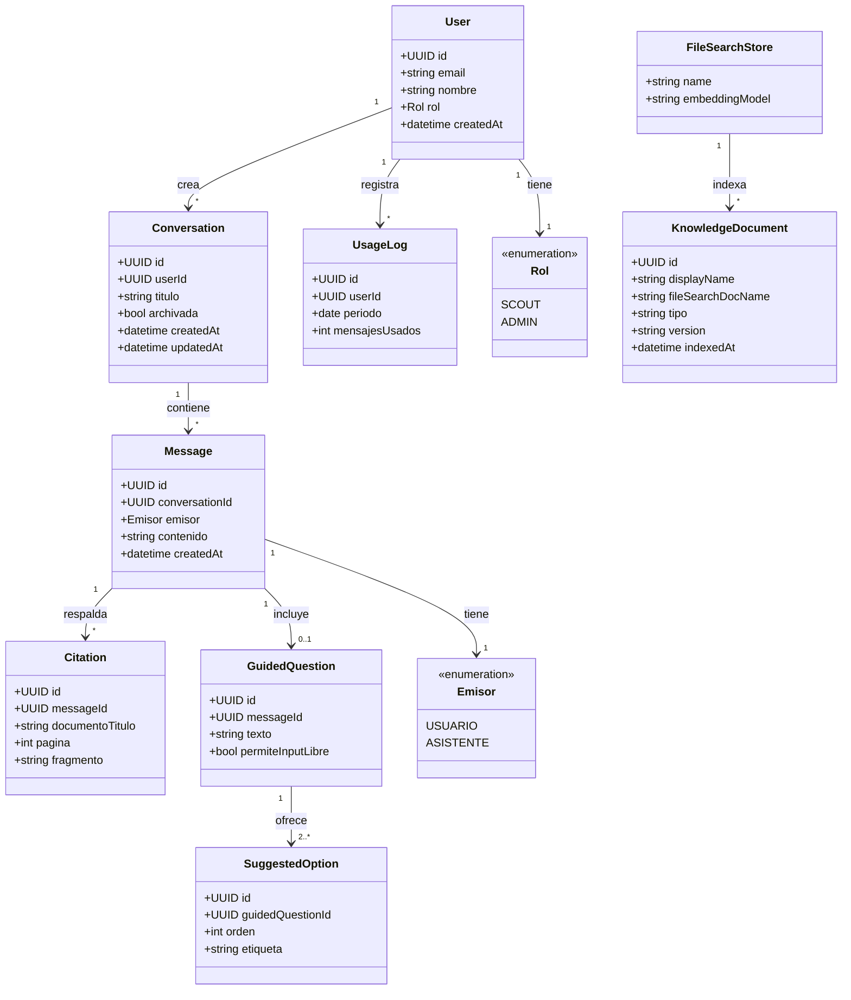
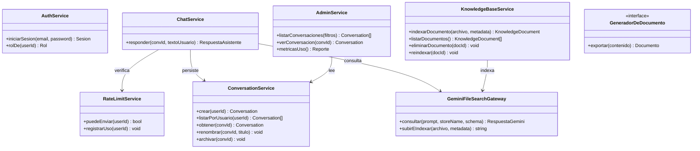
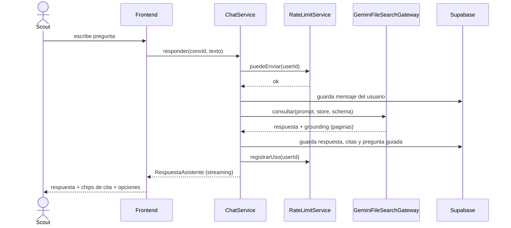

# Especificación de Software: Chat con Documentos para Scouts

> **ARCHIVADO — historia.** Primer borrador. Superado por la v0.2 (SRS) y `docs/pilot-scope-v0.3.1.md` (alcance). No construir contra este documento.

Versión 0.1 (borrador para validación)
Alcance de esta iteración: Chat con documentos + Preguntas guiadas con opciones.

---

## 1. Propósito y alcance

### 1.1 Propósito
Construir un asistente de IA donde los miembros de la organización Scout puedan preguntar sobre manuales y guías oficiales, y recibir respuestas fundamentadas con citas a la fuente y a la página. El sistema lleva control de usuarios y de uso, y permite a un administrador revisar todas las conversaciones.

### 1.2 En alcance (esta iteración)
- Autenticación y cuentas con control de uso.
- Conversaciones persistentes que se pueden retomar.
- Chat con documentos vía RAG administrado (Gemini File Search) con citas (documento + página).
- Mecanismo reutilizable de preguntas guiadas con opciones (1, 2, 3, input libre).
- Gestión de la base de conocimiento por el administrador (subir e indexar PDFs).
- Panel de administración para ver todas las conversaciones y el uso.

### 1.3 Fuera de alcance (esta iteración)
- Creador de proyectos Rover completo.
- Generación de documento Word. Por definición del producto, el Word es el borrador del proyecto Rover, así que pertenece al módulo Rover, que se especifica aparte.
- Multi-idioma (solo español por ahora).
- Interacción por voz.

### 1.4 Decisión de alcance sobre el Word
El Word queda diferido al módulo Rover. En esta iteración solo se define la costura de integración: una interfaz `GeneradorDeDocumento` y un disparador de exportación a nivel de mensaje. Así, cuando se construya Rover, se implementa esa interfaz y se conecta el botón, sin tocar el chat.

---

## 2. Glosario

- **Manual / Documento de conocimiento**: PDF oficial (manual o guía) que alimenta las respuestas.
- **File Search store**: contenedor persistente de embeddings administrado por Gemini.
- **Cita / grounding**: referencia que indica de qué documento y qué página salió la información.
- **Pregunta guiada**: pregunta que el asistente hace al usuario, acompañada de opciones predefinidas más la posibilidad de escribir una respuesta libre.
- **Conversación**: hilo de mensajes entre un usuario y el asistente, persistente y retomable.

---

## 3. Actores y roles

| Actor | Descripción |
|---|---|
| Scout (usuario) | Miembro registrado. Crea conversaciones, pregunta sobre los manuales, recibe respuestas con citas. Edad desde 15 años. |
| Administrador | Gestiona la base de conocimiento, ve todas las conversaciones y las métricas de uso. |
| Sistema de IA (Gemini) | Servicio externo que indexa documentos, recupera contexto y genera respuestas. No es un actor humano, se modela como dependencia. |

---

## 4. Funcionalidades

1. Cuentas y acceso: registro, inicio de sesión, roles.
2. Gestión de conversaciones: crear, listar, retomar, renombrar, archivar.
3. Chat con documentos: preguntar y recibir respuesta en streaming, fundamentada en los manuales.
4. Citas: cada respuesta muestra documento y página de origen cuando hay fundamento.
5. Preguntas guiadas con opciones: el asistente puede responder con una pregunta y opciones seleccionables, más input libre.
6. Base de conocimiento: el administrador sube PDFs, los indexa y los gestiona.
7. Control de uso: límite de mensajes por usuario para contener costos.
8. Administración: ver todas las conversaciones y el uso del sistema.
9. Costura Rover (diferida): interfaz de exportación a documento, sin implementación en esta iteración.

---

## 5. Requisitos funcionales (RF)

| ID | Requisito | Prioridad |
|---|---|---|
| RF-01 | El usuario puede registrarse con correo. La creación de la cuenta la realiza el propio usuario. | Must |
| RF-02 | El usuario puede iniciar sesión. | Must |
| RF-03 | El sistema distingue rol Scout y rol Administrador. | Must |
| RF-04 | El usuario puede crear una conversación nueva. | Must |
| RF-05 | El usuario puede listar sus conversaciones. | Must |
| RF-06 | El usuario puede retomar una conversación cargando su historial completo. | Must |
| RF-07 | El usuario puede renombrar una conversación. | Should |
| RF-08 | El usuario puede archivar una conversación. El borrado es lógico, no físico. | Should |
| RF-09 | El usuario envía una pregunta y recibe la respuesta en streaming. | Must |
| RF-10 | La respuesta se fundamenta en los manuales indexados mediante File Search. | Must |
| RF-11 | La respuesta muestra sus citas con nombre de documento y número de página cuando existen. | Must |
| RF-12 | El asistente puede incluir en su respuesta una pregunta guiada con opciones, según el contexto. | Must |
| RF-13 | El usuario puede seleccionar una opción sugerida, que se envía como su siguiente mensaje, o escribir una respuesta libre. | Must |
| RF-14 | El sistema aplica un límite de uso por usuario y por período. | Must |
| RF-15 | El administrador sube e indexa un manual PDF en el File Search store. | Must |
| RF-16 | El administrador lista, elimina y re-indexa documentos. | Should |
| RF-17 | El administrador ve todas las conversaciones de todos los usuarios. | Must |
| RF-18 | El administrador ve métricas de uso (mensajes por usuario y por período). | Should |
| RF-19 | (Costura Rover, diferido) El sistema expone una interfaz para exportar contenido a documento. Sin implementación en esta iteración. | Could |

### Reglas de las preguntas guiadas (detalle de RF-12)
El asistente usa preguntas guiadas en una mezcla de situaciones:
- **Aclaración**: cuando la pregunta del usuario es ambigua, responde con una pregunta y opciones para acotar.
- **Modo guiado**: cuando el usuario inicia un flujo guiado de forma explícita.
- **Sugerencia**: tras responder, ofrece opciones de próximos pasos.
Siempre que ofrece opciones, incluye la posibilidad de input libre.

---

## 6. Requisitos no funcionales (RNF)

| ID | Requisito |
|---|---|
| RNF-01 | Idioma de la interfaz y de las respuestas: español. |
| RNF-02 | Rendimiento: respuesta en streaming, con primeros tokens en pocos segundos. |
| RNF-03 | Costo: modelo Gemini Flash por defecto para el chat; límite de uso por usuario; indexación de documentos como operación puntual. |
| RNF-04 | Seguridad: autenticación obligatoria; políticas de acceso a nivel de fila en la base de datos; secretos solo en variables de entorno del servidor. |
| RNF-05 | Privacidad y menores: hay usuarios desde 15 años. Se activa moderación de contenido; las conversaciones se registran; la política de privacidad contempla menores según la organización. |
| RNF-06 | Disponibilidad: despliegue en Vercel. |
| RNF-07 | Mantenibilidad: re-indexar documentos debe ser una operación simple y repetible. |
| RNF-08 | Escalabilidad: soporta unos 80 usuarios hoy y un crecimiento de documentos sin rediseño. |
| RNF-09 | Trazabilidad: toda respuesta fundamentada conserva sus citas (documento + página). |
| RNF-10 | Auditabilidad: el administrador puede acceder a todas las conversaciones. |

---

## 7. Historias de usuario

Formato: Como [rol] quiero [acción] para [valor].

### Scout
- **HU-01** (Must, RF-01, RF-02): Como Scout quiero registrarme e iniciar sesión para tener mis conversaciones guardadas.
- **HU-02** (Must, RF-04, RF-09): Como Scout quiero preguntar sobre un manual en lenguaje natural para resolver dudas sin leer todo el documento.
- **HU-03** (Must, RF-11): Como Scout quiero ver de qué manual y página salió la respuesta para confiar en ella y poder ampliarla.
- **HU-04** (Must, RF-06): Como Scout quiero retomar una conversación anterior para continuar donde la dejé.
- **HU-05** (Must, RF-12, RF-13): Como Scout quiero que el bot me ofrezca opciones cuando mi pregunta es amplia para responder con un toque y avanzar más rápido.
- **HU-06** (Should, RF-07, RF-08): Como Scout quiero renombrar y archivar mis conversaciones para mantenerlas ordenadas.

### Administrador
- **HU-07** (Must, RF-15): Como Administrador quiero subir e indexar manuales en PDF para que el bot responda con base en ellos.
- **HU-08** (Should, RF-16): Como Administrador quiero re-indexar o eliminar documentos para mantener la base actualizada.
- **HU-09** (Must, RF-17): Como Administrador quiero ver todas las conversaciones de todos los usuarios para auditar el uso, sobre todo por la presencia de menores.
- **HU-10** (Should, RF-18): Como Administrador quiero ver métricas de uso por usuario para controlar costos antes de conectar el pago.

### Criterios de aceptación (las historias clave)

**HU-02 / HU-03 (preguntar y citar)**
```
Dado que estoy autenticado y en una conversación
Cuando envío una pregunta cubierta por los manuales
Entonces recibo una respuesta en streaming en español
Y la respuesta muestra al menos una cita con nombre de documento y número de página
```
```
Dado que envío una pregunta no cubierta por los manuales
Cuando el asistente no encuentra fundamento
Entonces indica que no tiene información en los manuales
Y no inventa una cita
```

**HU-05 (preguntas guiadas con opciones)**
```
Dado que envío una pregunta ambigua
Cuando el asistente necesita acotar
Entonces responde con una pregunta y entre 2 y 4 opciones
Y siempre habilita una opción de respuesta libre
```
```
Dado que el asistente me muestra opciones
Cuando selecciono una
Entonces esa opción se envía como mi siguiente mensaje
Y la conversación continúa con ese contexto
```

**HU-07 (indexar manuales)**
```
Dado que soy Administrador
Cuando subo un PDF válido y lo indexo
Entonces el documento queda disponible en el File Search store
Y su nombre visible se usará en las citas
```

**HU-09 (auditoría de conversaciones)**
```
Dado que soy Administrador
Cuando abro el panel de administración
Entonces puedo listar las conversaciones de cualquier usuario
Y puedo abrir una conversación para leer su contenido completo
```

---

## 8. Contrato de respuesta del asistente

El asistente devuelve una estructura. El texto va en `respuesta`, las citas se leen del grounding de Gemini y se normalizan, y la pregunta guiada es opcional. Este contrato es el corazón de las preguntas guiadas y se reutiliza tal cual en el módulo Rover.

```ts
type RespuestaAsistente = {
  respuesta: string;              // markdown en español
  citas: Cita[];                  // derivadas del grounding de File Search
  preguntaGuiada?: {              // opcional, segun contexto
    texto: string;
    opciones: string[];           // 2 a 4 etiquetas
    permiteInputLibre: boolean;   // siempre true por regla de producto
  };
  sugerencias?: string[];         // proximos pasos opcionales
};

type Cita = {
  documentoTitulo: string;        // nombre visible del manual
  pagina?: number;                // numero de pagina cuando aplica
  fragmento?: string;             // texto recuperado
};
```

Notas de implementación:
- Gemini 3 permite combinar File Search con salidas estructuradas, así que `respuesta`, `preguntaGuiada` y `sugerencias` se piden como JSON, mientras `citas` se arman desde el `groundingMetadata` de la misma llamada.
- El frontend renderiza la respuesta en markdown, las citas como chips (documento + página), y si hay `preguntaGuiada`, dibuja las opciones como botones más un campo de texto libre. Esto es UI dirigida por datos, sin streaming de componentes, para reducir riesgo en el MVP.

---

## 9. Modelo de dominio (diagrama de clases)



---

## 10. Servicios de aplicación (diagrama de clases)



La interfaz `GeneradorDeDocumento` queda declarada pero sin implementación. Es la costura por donde el módulo Rover conectará la exportación a Word.

---

## 11. Flujo principal: pregunta con cita y posible pregunta guiada



---

## 12. Arquitectura técnica (resumen)

| Capa | Tecnología | Responsabilidad |
|---|---|---|
| Frontend y API | Next.js (App Router) | UI de chat, rutas de servidor, render de citas y opciones |
| Auth y datos | Supabase (Auth + PostgreSQL) | Usuarios, conversaciones, mensajes, citas, metadata de documentos, uso |
| RAG y citas | Gemini File Search | Indexación, recuperación semántica y citas con página |
| Modelo de chat | Gemini 3.x Flash | Respuestas del día a día con salida estructurada |
| Despliegue | Vercel | Hosting y entrega |
| Base | Plantilla Next.js AI Chatbot | Auth, persistencia de chat y UI ya resueltas |

Nota sobre persistencia: la plantilla guarda el chat en Postgres. Se apunta esa conexión a Supabase para que historial, auth y metadata vivan en un solo lugar, lo que también resuelve la auditoría del administrador.

---

## 13. Supuestos (por validar)

- S-01: Cada usuario puede tener múltiples conversaciones, estilo ChatGPT.
- S-02: El borrado de conversaciones es lógico, para preservar la auditoría y por la presencia de menores.
- S-03: Las citas se muestran siempre que exista fundamento en los manuales.
- S-04: La indexación de manuales la hace el administrador de forma manual, no automática.
- S-05: El límite de uso es por número de mensajes por usuario y por período. Falta definir el número exacto.
- S-06: El registro de cuenta lo completa el propio usuario, no el sistema en su nombre.
- S-07: El Word y el creador Rover quedan diferidos, con la costura ya definida.

---

## 14. Riesgos y mitigaciones

| Riesgo | Mitigación |
|---|---|
| PDFs escaneados o con columnas degradan las citas | Revisar calidad al inicio; OCR o embedding multimodal si hace falta |
| Costos al crecer el uso | Límite por usuario, modelo Flash, métricas antes de conectar pago |
| Usuarios menores de edad | Moderación de contenido, registro de chats, política de privacidad acorde |
| Acoplamiento a Gemini para el RAG | Aceptado por ahora; la capa de datos en Supabase queda independiente |
| Complejidad de UI generativa | Usar UI dirigida por datos con componentes prehechos en el MVP |

---

## 15. Pendientes y próximos pasos

- Definir el número exacto del límite de uso (S-05).
- Confirmar los supuestos S-01 a S-07.
- Diseñar el esquema de tablas en Supabase a partir del modelo de dominio.
- Preparar el script de indexación de los 8 manuales.
- Especificar el módulo Rover y la implementación de `GeneradorDeDocumento`.
