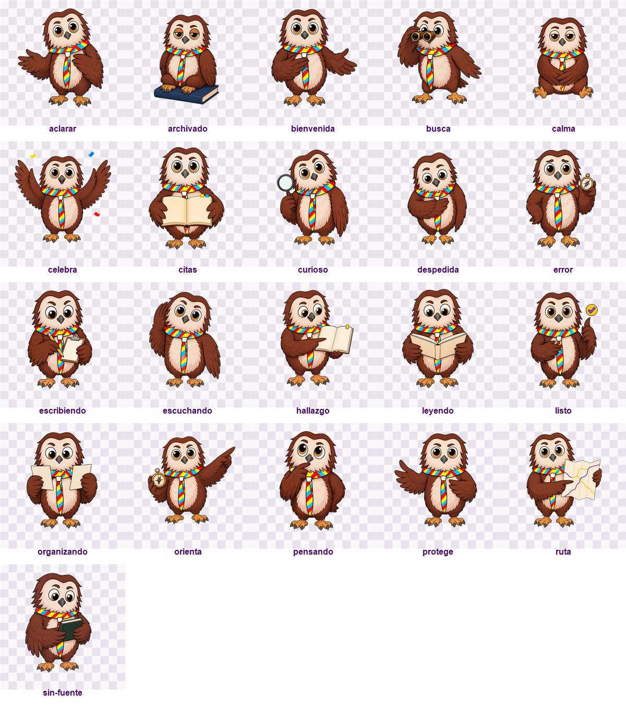

# Biblioteca visual de Zulú

Esta nota define el uso de las veintiuna poses de Zulú ubicadas en
`public/images/zulu/estados/`. Complementa `DESIGN.md`: no modifica el alcance
funcional del piloto ni introduce nuevos estados, respuestas o flujos.

## Tesis de personalidad

**Zulú acompaña cada consulta como un explorador de manuales: curioso al
empezar, concentrado al buscar, sereno cuando no encuentra respaldo y alegre
solo en logros que lo merecen.**

La mascota debe sentirse atenta, cálida y competente. Sus gestos aclaran el
momento de la interacción sin infantilizar al usuario, dramatizar un error ni
sustituir el contenido escrito.

## Inventario y uso semántico

Las rutas públicas parten de `/images/zulu/estados/`. Todas las imágenes son
PNG de 32 bits con canal alfa, tienen 512 px de alto y conservaron alfa `0` en
las cuatro esquinas durante la validación del 17 de agosto de 2026.

| Pose | Archivo | Tamaño | Uso semántico principal |
| --- | --- | ---: | --- |
| `aclarar` | `zulu-aclarar.png` | 479 × 512 px | La respuesta necesita una precisión del usuario. El gesto invita, no presiona. |
| `archivado` | `zulu-archivado.png` | 466 × 512 px | Conversación cerrada o disponible solo para consulta. |
| `bienvenida` | `zulu-bienvenida.png` | 475 × 512 px | Primer contacto, registro o introducción a una superficie. |
| `busca` | `zulu-busca.png` | 460 × 512 px | Búsqueda activa dentro de las fuentes durante la espera. |
| `calma` | `zulu-calma.png` | 461 × 512 px | Acompañamiento sereno en pausas o mensajes que requieren baja intensidad visual. |
| `celebra` | `zulu-celebra.png` | 512 × 512 px | Confirmación o éxito significativo y poco frecuente. |
| `citas` | `zulu-citas.png` | 469 × 512 px | Respuesta respaldada por citas o presentación de fuentes. |
| `curioso` | `zulu-curioso.png` | 512 × 512 px | Estado vacío del chat e invitación a comenzar una consulta. |
| `despedida` | `zulu-despedida.png` | 477 × 512 px | Cierre amable de una sesión o superficie, sin urgencia. |
| `error` | `zulu-error.png` | 471 × 512 px | Fallo técnico recuperable; mantiene una expresión serena. |
| `escribiendo` | `zulu-escribiendo.png` | 456 × 512 px | Espera local mientras se prepara la respuesta final; no representa streaming ni contenido parcial. |
| `escuchando` | `zulu-escuchando.png` | 478 × 512 px | Disponibilidad para recibir una pregunta o aclaración. |
| `hallazgo` | `zulu-hallazgo.png` | 512 × 512 px | Respuesta útil encontrada sin convertir la mascota en sello de veracidad. |
| `leyendo` | `zulu-leyendo.png` | 512 × 512 px | Paso de espera mientras se consultan manuales. |
| `listo` | `zulu-listo.png` | 480 × 512 px | Confirmación breve de que una acción terminó correctamente. |
| `organizando` | `zulu-organizando.png` | 475 × 512 px | Paso de espera mientras se estructura la respuesta ya solicitada. |
| `orienta` | `zulu-orienta.png` | 512 × 512 px | Pregunta guiada, sugerencia de dirección o próximo paso disponible. |
| `pensando` | `zulu-pensando.png` | 480 × 512 px | Inicio de la espera o procesamiento general. |
| `protege` | `zulu-protege.png` | 452 × 512 px | Límite visual sereno ante una acción no disponible o un aviso ya definido; no crea un flujo nuevo. |
| `ruta` | `zulu-ruta.png` | 478 × 512 px | Presentación de una ruta, secuencia o alternativas de navegación. |
| `sinFuente` | `zulu-sin-fuente.png` | 477 × 512 px | El sistema no encontró respaldo suficiente; la expresión no sugiere derrota. |

Los recursos históricos `public/images/zulu/zulu-marca.png` y
`public/images/zulu/zulu-saludando.png` siguen siendo parte de la marca, pero no
cuentan dentro de este catálogo de veintiún estados.

No existe una pose que habilite un flujo de salvaguarda. Los estados de
seguridad pertenecen al contrato de producto vigente; la ilustración nunca
debe añadir escalamiento, instrucciones ni interpretaciones por su cuenta.

El catálogo es una biblioteca, no un guion de aparición. Algunas poses quedan
como reserva reutilizable para futuros puntos de la interfaz. No deben mostrarse
ni animarse todas a la vez: cada superficie elige la variante de menor intensidad
que comunique su estado sin competir con el contenido.

## Reglas de arte

- Conservar la identidad exacta: búho de ojos ámbar grandes, plumaje marrón y
  crema, pico gris, pañuelo Scout rojo-amarillo-azul, hebilla clara, contorno
  negro y acabado ilustrado 2D pulido.
- Mostrar el cuerpo completo y centrado. Alas, patas, pañuelo y accesorios
  deben quedar dentro del lienzo, con aire alrededor de la silueta.
- Usar fondo realmente transparente en los archivos finales. No añadir plano
  de suelo, sombra horneada, resplandor, textura, degradado ni reflejo.
- Limitar cada pose a un gesto y, cuando corresponda, a un accesorio simple.
  Los accesorios no llevan texto y no pueden competir con la cara.
- Reservar verde puro `#00ff00` como color de recorte durante la generación;
  no usarlo en el personaje ni en los accesorios. Convertirlo a alfa antes de
  publicar y revisar bordes, huecos interiores y las cuatro esquinas.
- Mantener una altura maestra de 512 px y exportar como PNG RGBA. Al crear una
  variante nueva, comprobarla junto a las veintiuna existentes, no de forma
  aislada.
- No usar la pose `celebra` para respuestas rutinarias. La recompensa pierde
  valor si aparece en cada turno.

## Movimiento previsto

La pose aporta el significado; el movimiento solo añade presencia. La API
visual contempla cinco intensidades:

| Movimiento | Comportamiento | Uso |
| --- | --- | --- |
| `quieto` | Sin animación. | Encabezados, historiales densos o superficies donde el movimiento distrae. |
| `respira` | Elevación de 2 px, giro menor de 0,5° y escala casi imperceptible en un ciclo de 4,8 s. | Bienvenida, estado vacío y acompañamiento pasivo. |
| `explora` | Elevación de 3 px y balanceo suave en un ciclo de 3,6 s. | Curiosidad o aparición de un hallazgo. |
| `piensa` | Elevación de 3 px y balanceo algo más rápido, en un ciclo de 2,4 s. | Espera del servidor; puede alternar entre `pensando`, `leyendo` y `organizando`. |
| `celebra` | Un único salto corto con escala y giro leves, de unos 900 ms. | Confirmación puntual. Nunca debe repetirse en bucle. |

La transición entre poses puede usar una entrada breve de opacidad, escala y
desplazamiento vertical. No se interpolan dos PNG ni se aplican deformaciones a
la anatomía. Las animaciones en bucle se pausan cuando la mascota sale del
viewport o la pestaña deja de estar visible.

Las poses de reserva no necesitan un movimiento propio. Deben reutilizar una de
estas cinco intensidades o permanecer en `quieto`; sumar animaciones distintas
por pose fragmentaría la personalidad y aumentaría el ruido visual.

## Accesibilidad

- La mascota es decorativa: `aria-hidden="true"` y una imagen con `alt=""`.
  El texto cercano comunica el estado y conserva `role="status"`, `role="alert"`
  u otra semántica apropiada cuando corresponda.
- Nunca depender de color, pose o movimiento para explicar qué ocurrió o qué
  debe hacer el usuario.
- Con `prefers-reduced-motion: reduce`, desactivar ciclos, celebraciones y
  transiciones de pose. La ilustración estática debe conservar todo el sentido.
- Evitar parpadeos, rebotes continuos y cambios de pose más frecuentes que el
  texto de espera. La mascota no debe secuestrar el foco ni crear un objetivo
  táctil si no es interactiva.

## Receta de generación reutilizable

Para conservar la identidad, usar una sola imagen aprobada de Zulú como
referencia. Generar cada pose por separado. La instrucción común recomendada es:

> **Use case: identity-preserve.** Create one UI mascot asset. Use Image 1 as
> the sole identity and style reference. Preserve the exact owl identity,
> species, silhouette and proportions, face, huge amber eyes, brown-and-cream
> feather pattern, gray beak, red-yellow-blue Scout neckerchief, pale buckle,
> black outlines, and polished 2D illustrated finish. Show the full body,
> centered, with the entire silhouette, feet, wings and scarf visible and
> generous padding. Change only the requested pose and prop. Use a flat,
> uniform `#00ff00` chroma background with no shadows, gradients, textures,
> reflections, floor plane or glow. Do not use green on the subject. No text,
> watermark, extra character or extra object.

Añadir exactamente una de estas veintiuna instrucciones específicas al final:

1. **Aclarar:** expresión paciente, cabeza ligeramente inclinada y un ala
   abierta que invite a precisar la pregunta; sin accesorio.
2. **Archivado:** despierto y relajado, sentado sobre un único manual crema
   cerrado; sensación de cierre tranquilo, no de sueño.
3. **Bienvenida:** un ala sobre el pecho y la otra abierta hacia el usuario;
   gesto cálido y contenido.
4. **Celebra:** ambas alas levantadas y exactamente tres piezas pequeñas de
   confeti, una roja, una amarilla y una azul; alegría moderada.
5. **Citas:** presenta un único manual crema abierto con exactamente dos
   pestañas sin texto, una amarilla y una azul.
6. **Curioso:** sostiene una sola lupa y ladea la cabeza con interés; nada más.
7. **Error:** expresión preocupada pero serena y una sola brújula cuya aguja
   parece desorientada; sin alarma ni dramatismo.
8. **Hallazgo:** muestra un único manual abierto y señala una página útil con
   una pestaña amarilla; expresión de descubrimiento tranquilo.
9. **Leyendo:** lee atentamente un único manual crema abierto; mirada dirigida
   a las páginas y postura concentrada.
10. **Organizando:** sostiene exactamente dos notas crema en blanco y las
    compara; no añadir lápices, texto ni más papeles.
11. **Pensando:** apoya suavemente un ala bajo el pico y mira un poco hacia
    arriba; sin accesorio.
12. **Sin fuente:** acompaña un único manual crema cerrado con expresión serena
    y honesta; no parecer triste, derrotado ni alarmado.
13. **Busca:** observa atentamente a través de unos únicos binoculares pequeños;
    postura alerta, un ala sostiene el visor y la otra se abre para equilibrar.
14. **Calma:** sentado con las alas cruzadas suavemente sobre el cuerpo y los
    ojos relajados; sin accesorio y sin parecer dormido.
15. **Despedida:** gesto de cierre cálido, cabeza levemente inclinada y un ala
    sobre el pecho; la otra descansa al costado, sin accesorio.
16. **Escribiendo:** sostiene un único portapapeles crema en blanco y un lápiz;
    mirada concentrada, sin letras, líneas ni marcas sobre la hoja.
17. **Escuchando:** inclina la cabeza y acerca un ala al costado de la cabeza
    como quien escucha con atención; sin accesorio.
18. **Listo:** un ala sobre el pecho y la otra levantada junto a una única
    insignia circular amarilla con un visto morado; expresión segura y amable.
19. **Orienta:** sostiene una única brújula y extiende la otra ala para señalar
    una dirección ascendente; gesto claro, no autoritario.
20. **Protege:** un ala abierta forma un límite amable frente al usuario y la
    otra permanece cerca del pecho; expresión firme, serena y sin accesorio.
21. **Ruta:** sostiene un único mapa crema plegado con líneas simples amarillas
    y moradas, y señala un punto del recorrido; sin nombres, símbolos ni texto.

### Preparación del archivo final

1. Recortar el verde a partir del color del borde y su dominancia cromática,
   conservando alfa parcial en el contorno antialias.
2. Conservar la relación de aspecto y el margen generoso del lienzo generado;
   reencuadrar solo si alguna parte del cuerpo quedó demasiado cerca del borde.
3. Escalar a un máximo de 512 px de alto sin ampliar una fuente menor.
4. Guardar en PNG RGBA bajo `public/images/zulu/estados/` con el patrón
   `zulu-<pose>.png`.
5. Verificar alfa en las cuatro esquinas, ausencia de halo verde, anatomía,
   pañuelo, accesorio y coherencia de escala frente al catálogo completo.
